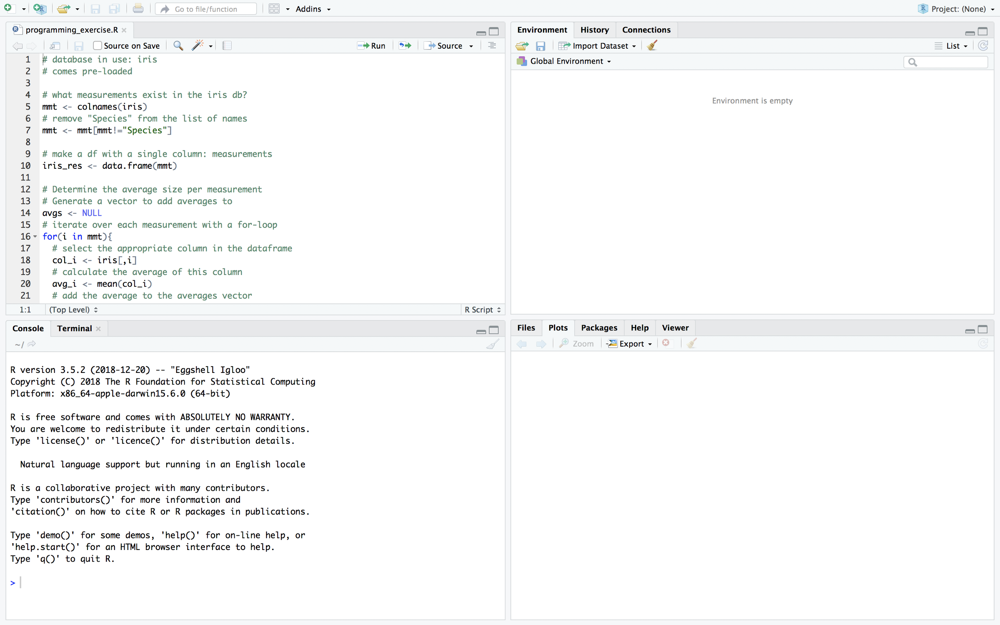
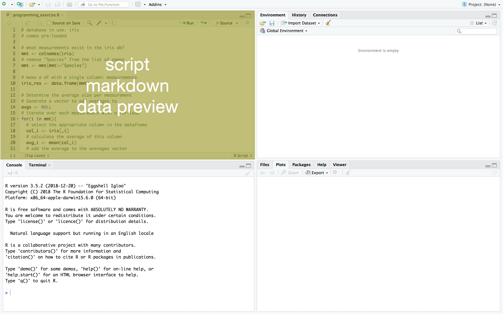
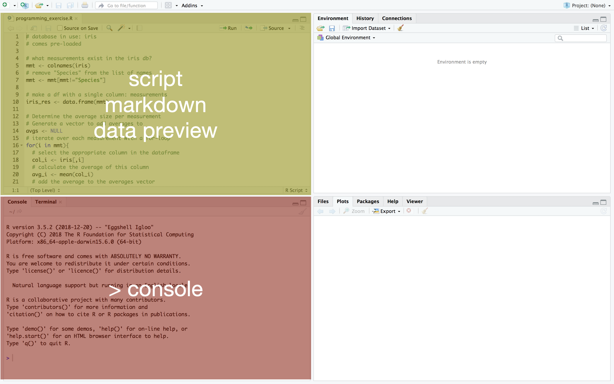
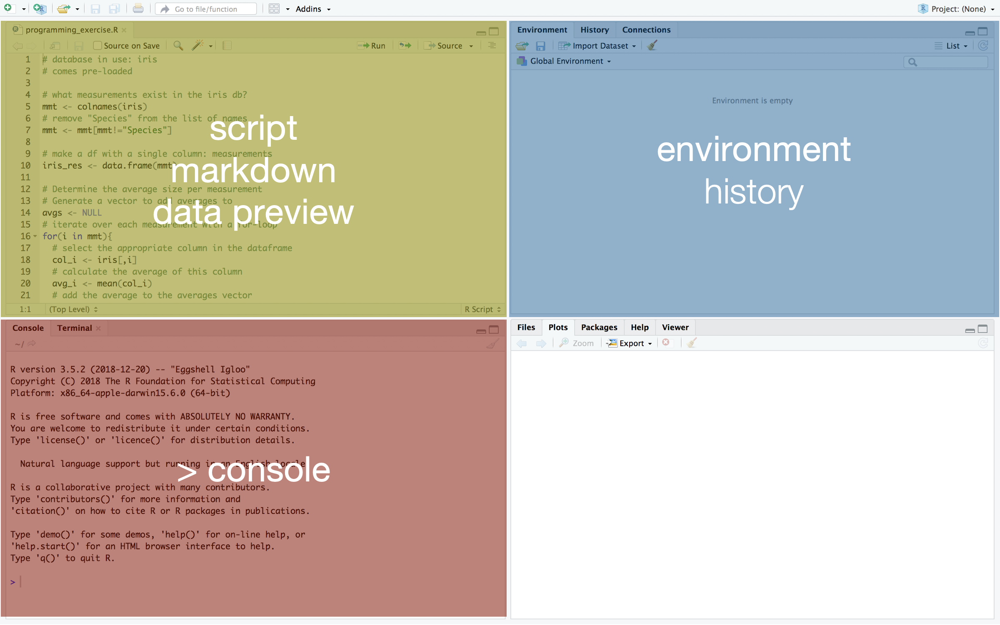
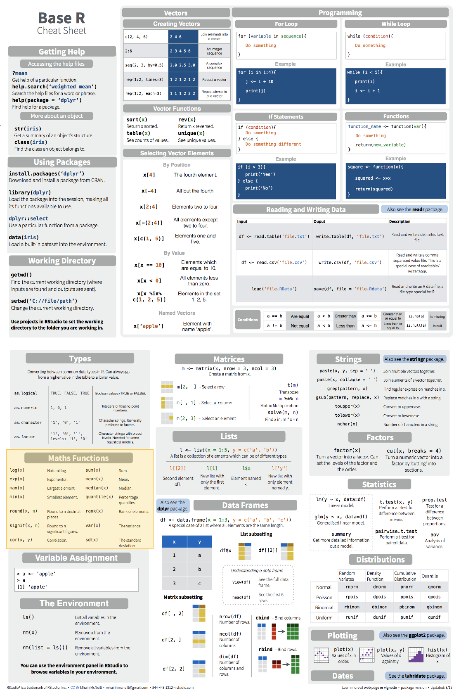

```{r setup, include=FALSE}
options(htmltools.dir.version = FALSE)
```

# Welcome! Who are you?

- Your name & pronouns

- What is your faculty/background? (Economics, Medicine, Biology…)

- What part of your education are you in? (Bachelor, PhD, prof…)

- What is your motivation for learning R?

- What is your experience with R?


---
# How to ask for help?

#### What you can do:
- *During presentations*: Use the Teams chat to ask questions
- *During exercises*: Put an X in the purple column of the [status chart](https://docs.google.com/document/d/1X1btpp99IgslvqtuNew0Igcpe6y6_T_phVqzNSosX-0/edit#heading=h.8nqh57o1bbwx) (with an optional explanation of your question)


--

#### What we will do:
- Answer your question in writing; right there, right then.
- Invite you to an individual google hangout, where someone can assist you.

#### Also: use the status chart when you are done with an exercise!

---
# Course materials

### Slides, exercises, cheatsheets

1. Go to [tinyurl.com/introRData](https://github.com/UtrechtUniversity/workshop-introduction-to-R-and-data)

1. Follow the link on the main page to the slides

1. click  then 

1. Unzip the download

1. Store it in a single, local (i.e. not on a mounted drive), accessible location.


### Collaborative document

1. Go to [tinyurl.com/introRDatadoc](https://docs.google.com/document/d/1X1btpp99IgslvqtuNew0Igcpe6y6_T_phVqzNSosX-0/edit?usp=sharing)

1. Fill out your name in the status chart!

---
# General guidelines (and advice!)
- Ask for help when you need it, and alert us when we need to slow down!

--

- Please mute yourself when you are not speaking.

--

- Use the green column of the status chart when you finished an exercise.

--

- Close as many unnecessary windows and programs as possible.

--

- Take a computer break when we take a break: a timer will show when we return!
---
class: inverse, middle, center
# Introduction to R & Data

### Part 1: Basics of R
---
# What is R?

.left-column[
]

.right-column[

- A widely used programming language for data analysis

- Based on statistical programming language S (1976)

- Developed by **R**oss Ihaka & **R**obert Gentleman (1995)

- Very active community, with many (often subject-specific) packages

- Open source, and interoperable!

]
---
# We will work in Rstudio


- **I**ntegrated **D**evelopment **E**nvironment (IDE) for R

- Founded by J.J. Allaire, available since 2010

- Bloody useful! Let’s take a look: please open RStudio!

---
# The Rstudio interface



---
# The Rstudio interface



---
# The Rstudio interface



---
# The Rstudio interface



---
# The Rstudio interface


---
# Running R code

#### In a script/Rmarkdown document
- Place your cursor in the line of code you want to execute

- Press  or ctrl + enter

- When running multiple lines: select all lines, then press ‘Run’ or ctrl+enter

#### In an Rmarkdown document
- You can execute a chunk as a whole with the green triangle:


---
class: exercise
# Exercise 0: running your first code

_Before you start: make sure you have downloaded the course materials, and unzipped them to a single, accessible folder._

1. In Rstudio, choose **File** > **Open Project**

1. Navigate to the folder with course materials

1. Open **introduction-to-R-and-data-github.Rproj**

1. From the ‘files’ menu (bottom right), select **baseR_exercises.Rmd**

1. Run the R code in Exercise 0 

1. When you are done: place an X in the green column of the [status chart](https://docs.google.com/document/d/1X1btpp99IgslvqtuNew0Igcpe6y6_T_phVqzNSosX-0/edit?usp=sharing).


---
class: inverse, middle, center
# R syntax & the console

### - Data types in R
### - Using functions
### - Combining data
### - Indexing data

---
# Always distinguish:

Giving R information:
```{r}
x <- 1
```
Asking R a question:
```{r}
x
```

Note:
- Answers on our slides will be preceded with `##`; not the case in your console
- Answers (both in the console and on the slide) are indexed with `[i]`
- The assignment operator in R is a 'carrot-stick' or arrow: <-

#### Also: We will have plenty of exercises, so you can focus on the slides when we present!

---
# Which are these?

#### Giving information, or asking a question?

### 1: 
```{r}
4 + 5
```
--

### 2: 
```{r}
var <- 73
```
--

### 3: 
```{r}
var/x
```
---
# Variable assignment

.pull-left[
You can assign both numbers and text to a variable:

```{r}
x <- 6

x <- 'apple'

x <- "hello world"

x = 6
```

]

--

.pull-right[

 
#### (in course materials folder **cheatsheets/**)]

---
# Maths functions

.pull-left[
You can perform math with your variables:
```{r}
x * 3
```
and store the results as new variables:
```{r}
y <- x + 2

log2(y)
```

]

--

.pull-right[

]


---
class: exercise
# Exercise 1

1. Do the following calculation in R: _1 plus 5, divided by 9_

2. Assign the result of the calculation to a variable.

1. (Bonus) Round off the result to 1 decimal.
    
    _Tip: Use the Maths Functions section of your cheat sheet!_


---
# Exercise 1

1. Do the following calculation in R: _1 plus 5, divided by 9_
    ```{r}
    (1+5)/9
    ```

2. Assign the result of the calculation to a variable.
    ```{r}
    x <- (1+5)/9
    ```

1. (Bonus) Round off the result to 1 decimal.
    ```{r}
    round(x,1)
    ```

---
# Another data type: logical

.pull-left[A logical is `True` or `False`, and can also be written as `T` or `F`.

```{r}
TRUE
FALSE
T
F
```
]

--

.pull-right[Logicals are mostly used as tests:

| | | |
|---|---|---|
| == | `==`  |is equal to |
| != | `!=` | is not |
| >= | `>=` | larger than or equal to |
| < | `<`  | smaller than |

```{r}
x==6
x!=10
2>4
```
]

---
# Combining data: creating vectors
#### Vectors are created with the function `c()`

A numeric vector:
```{r}
c(1,2,3)
```

--

A character vector:
```{r}
c("a","b","c")
```

--

A logical vector:
```{r}
c(T,TRUE,F)
```

---
# Combining data: creating vectors

What is this vector?
```{r}
c(TRUE,"a",3)
```

--

#### Yep, a character vector!
Vector type defaults to the "lowest common denominator": everything can be a character, but not everything can be a number or a logical.
---
# Vector functions
#### Vectors can be used in mathematical operations
.pull-left-medium[
```{r}
p <- 1:5
p
mean(p)
p * 2
```
]
--
.pull-right-medium[
| &nbsp; &nbsp; p &nbsp; &nbsp;  | &nbsp; &nbsp; 2&nbsp; &nbsp;  | &nbsp; &nbsp; &nbsp; &nbsp; &nbsp;  |
|:---:|:---:|:---:|
| 1 | 2 | 2 |
| 2 | 2 | 4 |
| 3 | 2 | 6 |
| 4 | 2 | 8 |
| 5 | 2 | 10 |
]
---
# Vector functions
#### Operations with multiple vectors are performed by aligning the index
.pull-left-medium[
```{r}
q <- 5:1
q
p * q
```
]

.pull-right-medium[<br />

| &nbsp; &nbsp; p &nbsp; &nbsp;  | &nbsp; &nbsp;q &nbsp; &nbsp;  | &nbsp; &nbsp; &nbsp; &nbsp; &nbsp;  |
|:---:|:---:|:---:|
| 1 | 5 | 5 |
| 2 | 4 | 8 |
| 3 | 3 | 9 |
| 4 | 2 | 8 |
| 5 | 1 | 5 |
]

---
class: exercise
# Exercise 2: create vectors

#### Meet Ann, Bob, Chloe, and Dan.

1. Make a character vector with their names, using the function `c()`. Save the vector as name.

1. How old are Ann, Bob, Chloe, and Dan? Design a numeric vector with their respective ages. Save it as `age`.

1. Bonus: What is their average age? Use a function in R to calculate this.


---
# Excercise 2: create vectors

1. Make a character vector with their names, using the function `c()`. Save the vector as name.
    ```{r}
    name <- c("Ann", "Bob", "Chloe", "Dan")
    ```
1. How old are Ann, Bob, Chloe, and Dan? Design a numeric vector with their respective ages. Save it as `age`.
    ```{r}
    age <- c(35,22,50,51)
    ```
1. Bonus: What is their average age? Use a function in R to calculate this.
    ```{r}
    mean(age)
    ```

---
# Data structures: vector

#### We have two vectors: `name` and `age`
```{r}
name
age
```

#### Combine the vectors to a unidimensional vector, with `c()`
```{r}
c(name,age)
```

---
# Data structures: list

#### We have two vectors: `name` and `age`
```{r}
name
age
```

#### Combine the vectors to a multidimensional list, with `list()`
```{r}
list(name,age)
```

---
# Data structures: data frame

#### We have two vectors: `name` and `age`
```{r}
name
age
```

#### Combine the vectors to a twodimensional data frame, with `data.frame()`
```{r}
data.frame(name,age)
```
]
---
# Data structures: summary

&nbsp;

| &nbsp; &nbsp; &nbsp; &nbsp; &nbsp;  | number of dimensions  | &nbsp; function &nbsp; |
|---:|:---:|:---|
| vector | 1 | &nbsp; &nbsp; `c()` |
| data frame | 2 | &nbsp; &nbsp; `data.frame()`  |
| list | any number | &nbsp; &nbsp; `list()` |

---


---


