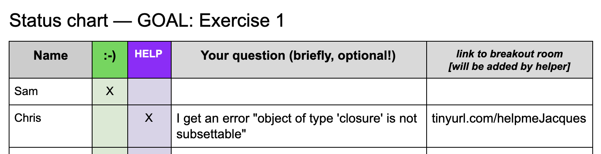
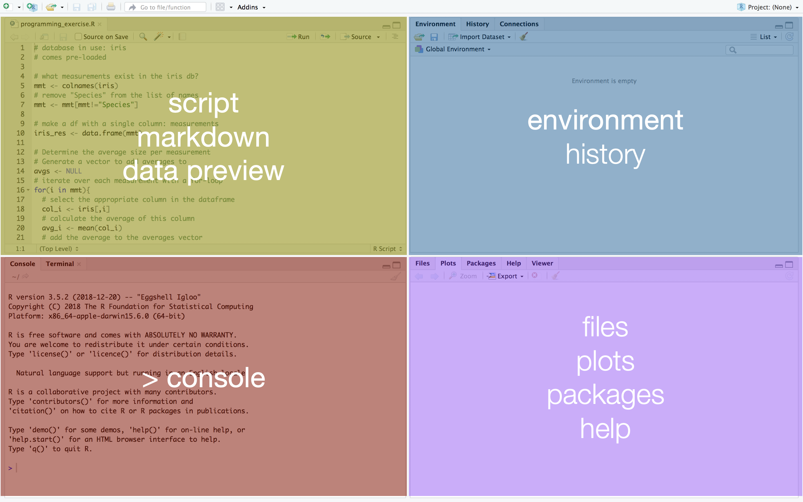
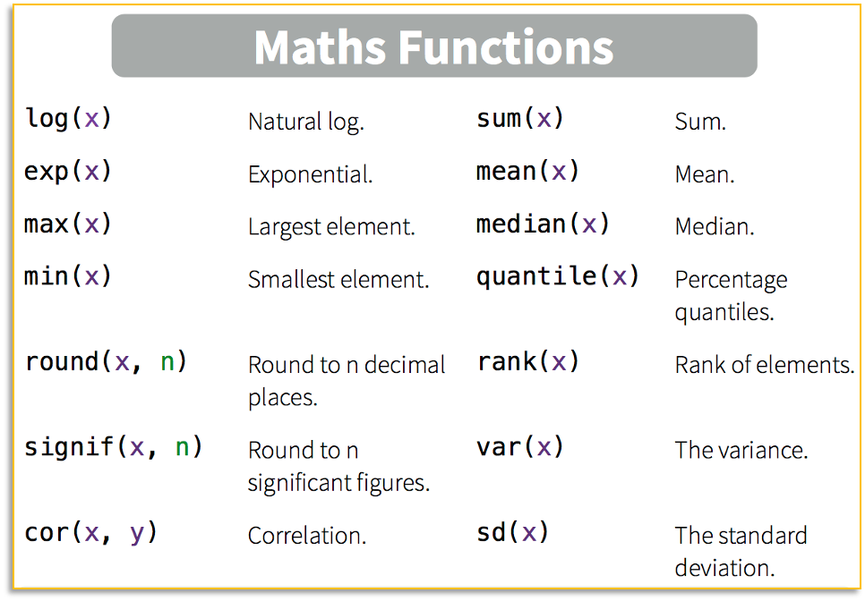
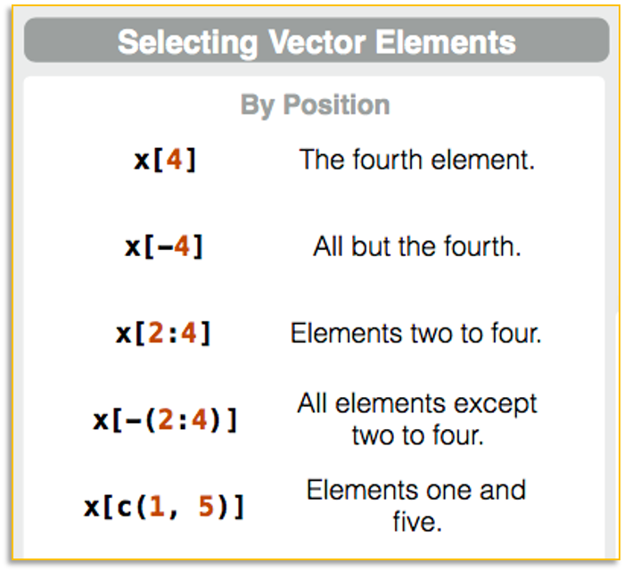

```{r setup, include=FALSE}
options(htmltools.dir.version = FALSE)
```

# Welcome! Who are you?

- Your name & pronouns

- What is your faculty/background? (Economics, Medicine, Biology…)

- What part of your education are you in? (Bachelor, PhD, prof…)

- What is your motivation for learning R?

- What is your experience with R?


---
# How to ask for help?

#### What you can do:
- *During presentations*: Use the Teams chat to ask questions
- *During exercises*: Put an X in the red column of the [status chart](https://docs.google.com/document/d/1X1btpp99IgslvqtuNew0Igcpe6y6_T_phVqzNSosX-0/edit#heading=h.8nqh57o1bbwx) (with an optional explanation of your question)


--

#### What we will do:
- Answer your question either in writing or in the presentation, right there, right then.
- Invite you to an individual helper channel, where someone can assist you.

#### Also: indicate your progress on the status chart, so we can keep track!

---
# Course materials

### Slides, exercises, cheatsheets

1. Go to [tinyurl.com/introRData](https://github.com/UtrechtUniversity/workshop-introduction-to-R-and-data)

1. Follow the link on the main page to the slides

1. click  then 

1. Unzip the download

1. Store it in a single, local (i.e. not on a mounted drive), accessible location.


### Collaborative document

1. Go to [tinyurl.com/introRDatadoc](https://docs.google.com/document/d/1X1btpp99IgslvqtuNew0Igcpe6y6_T_phVqzNSosX-0/edit?usp=sharing)

1. Fill out your name in the status chart!

---
# General guidelines (and advice!)
- Ask for help when you need it, and alert us when we need to slow down!

--

- Please mute yourself when you are not speaking.

--

- Use the green column of the status chart when you finished an exercise.

--

- Close as many unnecessary windows and programs as possible.

--

- Take a computer break when we take a break: a timer will show when we return!
---
class: inverse, middle, center
# Introduction to R & Data

### Part 1: Basics of R
---
# What is R?

.left-column[
]

.right-column[

- A widely used programming language for data analysis

- Based on statistical programming language S (1976)

- Developed by **R**oss Ihaka & **R**obert Gentleman (1995)

- Very active community, with many (often subject-specific) packages

- Open source, and interoperable!

]
---
# We will work in Rstudio


- **I**ntegrated **D**evelopment **E**nvironment (IDE) for R

- Founded by J.J. Allaire, available since 2010

- Bloody useful! Let’s take a look: please open RStudio!

---
# The Rstudio interface



---
# Running R code

#### In a script/Rmarkdown document
- Place your cursor in the line of code you want to execute

- Press  or ctrl + enter

- When running multiple lines: select all lines, then press ‘Run’ or ctrl+enter

#### In an Rmarkdown document
- You can execute a chunk as a whole with the green triangle:


---
# Open course materials

_Before you start: make sure you have downloaded the [course materials](https://github.com/UtrechtUniversity/workshop-introduction-to-R-and-data), and unzipped them to a single, accessible folder._

1. In Rstudio, choose **File** > **Open Project**

1. Navigate to the folder with course materials

1. Open **workshop.Rproj**

1. From the ‘files’ menu (bottom right), select **baseR_exercises.Rmd**


---
class: inverse, middle, center
# R syntax & data types

---
# Variable assignment

.pull-left[
You can assign both numbers and text to a variable:

```{r}
x <- 6

x <- 'apple'

x <- "hello world"

x = 6
```

]

.pull-right-center[

 

[download this cheat sheet](http://github.com/rstudio/cheatsheets/raw/master/base-r.pdf)
]

---
# Do you expect an answer?

Saving information:
```{r}
x <- 1
```
Asking for information to be returned:
```{r}
x
```

Note the difference in syntax: when using the <- operator, you are storing the information as a variable in R, and therefore you do not expect to get an answer immediately.

When calling up that information, or making calculations, you can make R show you the answer.

---
# Maths functions

You can perform math with your variables:
```{r}
x * 3
```
and store the results as new variables:
```{r}
y <- x + 2

log2(y)
```

Check **"Maths Functions"** on the [cheat sheet](http://github.com/rstudio/cheatsheets/raw/master/base-r.pdf):


---
# Logicals

A logical is `True` or `False`, and can also be written as `T` or `F`.

Logicals are mostly used as tests:

| | | |
|---|---|---|
| == | `==`  |is equal to |
| != | `!=` | is not |
| >= | `>=` | larger than or equal to |
| < | `<`  | smaller than |

For example:
```{r}
x == 6
x != 10
```

---
# Answers to exercise 1

1. Do the following calculation in R: _1 plus 5, divided by 9_
    ```{r}
    (1+5)/9
    ```
--

1. Assign the result of the calculation to a variable.
    ```{r}
    x <- (1+5)/9
    ```
--

1. Test if the result is larger than 1.
    ```{r}
    x > 1
    ```
--

1. Round off the result to 1 decimal.
    ```{r}
    round(x,1)
    ```


---
class: inverse, middle, center
# Vectors in R

---
# Combining data: creating vectors
#### Vectors are created with the function `c()`

A numeric vector:
```{r}
c(1,2,3)
```

--

A character vector:
```{r}
c("a","b","c")
```

--

A logical vector:
```{r}
c(T,TRUE,F)
```

---
# Combining data: creating vectors

What is this vector?
```{r}
c(TRUE,"a",3)
```

--

#### Yep, a character vector!
Vector type defaults to the "lowest common denominator": everything can be a character, but not everything can be a number or a logical.
---
# Vector functions
#### Vectors can be used in mathematical operations
.pull-left-medium[
```{r}
p <- 1:5
p
mean(p)
p * 2
```
]
--
.pull-right-medium[
| &nbsp; &nbsp; p &nbsp; &nbsp;  | &nbsp; &nbsp; 2&nbsp; &nbsp;  | &nbsp; &nbsp; &nbsp; &nbsp; &nbsp;  |
|:---:|:---:|:---:|
| 1 | 2 | 2 |
| 2 | 2 | 4 |
| 3 | 2 | 6 |
| 4 | 2 | 8 |
| 5 | 2 | 10 |
]
---
# Vector functions
#### Operations with multiple vectors are performed by aligning the index
.pull-left-medium[<br />
```{r}
q <- 5:1
q
p * q
```
]

.pull-right-medium[<br />

| &nbsp; &nbsp; p &nbsp; &nbsp;  | &nbsp; &nbsp;q &nbsp; &nbsp;  | &nbsp; &nbsp; &nbsp; &nbsp; &nbsp;  |
|:---:|:---:|:---:|
| 1 | 5 | 5 |
| 2 | 4 | 8 |
| 3 | 3 | 9 |
| 4 | 2 | 8 |
| 5 | 1 | 5 |
]


---
# Answers to exercise 2

1. Make a character vector with their names, using the function `c()`. Save the vector as name.
    ```{r}
    name <- c("Ann", "Bob", "Chloe", "Dan")
    ```
--

1. How old are Ann, Bob, Chloe, and Dan? Design a numeric vector with their respective ages. Save it as `age`.
    ```{r}
    age <- c(35,22,50,51)
    ```
--

1. What is their average age? Use a function in R to calculate this.
    ```{r}
    mean(age)
    ```

---
class: inverse, middle, center
# Data structures

---
# Data structures: vector

#### We have two vectors: `name` and `age`
```{r}
name
age
```

#### Combine the vectors to a unidimensional vector, with `c()`
```{r}
c(name,age)
```

---
# Data structures: list

#### We have two vectors: `name` and `age`
```{r}
name
age
```

#### Combine the vectors to a multidimensional list, with `list()`
```{r}
list(name,age)
```

---
# Data structures: data frame

#### We have two vectors: `name` and `age`
```{r}
name
age
```

#### Combine the vectors to a twodimensional data frame, with `data.frame()`
```{r}
data.frame(name,age)
```

---
# Data structures: summary

&nbsp;

| &nbsp; &nbsp; &nbsp; &nbsp; &nbsp;  | number of dimensions  | &nbsp; function &nbsp; |
|---:|:---:|:---|
| vector | 1 | &nbsp; &nbsp; `c()` |
| data frame | 2 | &nbsp; &nbsp; `data.frame()`  |
| list | any number | &nbsp; &nbsp; `list()` |

---
# Factors

#### a special type of vector, defined by _levels_
```{r}
country <- c("UK","USA","USA","UK")
country
factor(country)
```

#### usually as column in a data frame: a categorical variable
.pull-left[
```{r}
df <- data.frame(name, age,
                 country = factor(country))
df
```
]
.pull-right[
```{r}
summary(df)
```

]

---
# Answers to exercise 3

1. Create a vector `country` containing four countries (use at least one duplicate!).
    ```{r}
    country <- c("UK", "US", "US", "UK")
    ```
--

1. Create a data frame combining `name`, `age`, and `country`, and save it as `df`.
    ```{r}
    df <- data.frame(name, age, country)
    ```
--

1. Check your dataframe with the function `summary()`. Does it contain a factor?
    ```{r}
    summary(df)
    ```
---
# Answers to exercise 3 (continued)

`4.` Make sure your column `country` is a factor, and confirm this with `summary()`.
```{r}
country <- factor(country)
country

df <- data.frame(name, age, country)

summary(df)
```

--

`5.` Create a list with your vectors `name` and `age`, and save it as `mylist`.
```{r}
mylist <- list(name,age)
```

---
class: inverse, middle, center
# Missing data

---
# Not Available (NA)

Let's add a column to our data:
```{r}
df$pet <- factor(c("cat","none","fish",NA))

df$pet
```

#### Note that `NA` is not a level!

--
.pull-left[
Here is our data frame:

```{r, echo=F}
knitr::kable(df, format="html")
```
]
--

.pull-right[
Notice that:

- we know that Bob has no pets. 

- we do not know if Dan has pets
]
---
# Predict the answer

```r
5 == 5
```
--
```{r echo = F}
5 == 5
```
--
```r
5 == NA
```
--
```{r echo = F}
5 == NA
```
--

```r
NA == NA
```
--
```{r echo = F}
NA == NA
```
--

```{r}
is.na(NA)
```


---
# NULL: data does not exist

Do we know about our participants' jobs?

```{r}
df$job
```

--

| | |
|---:|:---|
| `NA` | Information is **N**ot **A**vailable |
| `NULL` | Information does not exist |
| `none` or `0` | Data entry specifying content of 0 |

---
class: inverse, middle, center
# Indexing vectors & lists

---
# Selecting vector elements by position

.pull-left[
```{r}
name
name[2]
name[1:3]
name[c(2,2,1)]
```
]
.pull-right[

]

---
# Selecting vector elements by value

.pull-left[
Selecting from vector `age`:
```{r}
age

age[age>40]

age>40
```


]
.pull-right[
Breaking down the selection:
```{r, echo=F}

df2 <- data.frame(age, age>40)
df2[,3] <- c("","",age[3],age[4])
names(df2) <- c("  age  ", "  age > 40  ", "  age[age > 40]  ")

knitr::kable(df2, format="html")
```


]

---
# Selecting vector elements by value
```{r}
name

name[name %in% c("Chloe","Ann","Evie")]
```


---
# Selecting from a list

```{r}
mylist
```
--

.pull-left[
Selecting a list element from `mylist`:

```{r}
mylist[1]
```

Sub-selection in the list-element:

```{r}
mylist[1][2]
```
]
--

.pull-right[
Selecting the content of a list element:

```{r}
mylist[[1]]
```

Subselection in the content of a list element:

```{r}
mylist[[1]][2]
```
]

---
# Answers to exercise 5

1. Return only the first number in your vector `age`.
    ```{r}
    age[1]
    ```
--

1. Return the 2nd and 4th name in your vector `name`.
    ```{r}
    name[c(2,4)]
    ```
--

1. Return only ages under 30 from your vector `age`.
    ```{r}
    age[age<30]
    ```
--

1. Return the name "Chloe" from your list `mylist`.
    ```{r}
    mylist[[1]][name == "Chloe"]
    ```

---
class: inverse, middle, center
# Indexing a data frame

---
---
---
---
# Answers to exercise 6
---
class: inverse, middle, center
# Recap "Basics of R"
---
---
---

class: inverse, middle, center
# Programming: if-statements

---
---
---
# Answers to exercise 7
---
class: inverse, middle, center
# Programming: functions

---
---
---
# Answers to exercise 8
---
class: inverse, middle, center
# Programming: loops

---
---
---
# Answers to exercise 9
---
class: inverse, middle, center
# Recap Programming

---
---
---
---